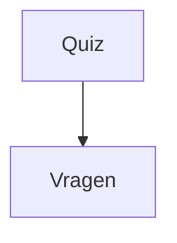

# QuizTime
QuizTime example


QuizTime heeft 2 projecten.
1. Project UI
2. Project Domain

Eigenlijk zou ik ook een 3e project willen hebben die Infrastructuur heet.
Maar zoal ik het niet nodig heb staat deze er nog niet in. Die kunnen we later toevoegen als we de quiz willen opslaan.

# Project Wpf
Bevat de visual controls en alles wat nodig is om het je programma input/output te tonen.

We gebruiken in de project UserControls voor het maken van verschillende schermen. We hadden ook Pages kunnen gebruiken, maar dit is ook prima voor nu.

Wat we doen in de MainWindow. Daar voegen we een 
```xml
<ContentControl Name="ContentControl"></ContentControl>
```
 toe in Xaml. De ContentControl heeft een property Control. Deze moet een UserControl bevatten. Nou laten we net alle onze pagina's in UserControl's maken. Dat is makkelijk. Dus die moeten vanuit alle UserControl zetten om er zo door heen te navigeren.

Dit doen we door in de Constructor van alle controls het MainWindow control mee te geven.

```csharp
    public partial class StartUserControl : UserControl
    {
        private readonly MainWindow _mainWindow;

        public StartUserControl(MainWindow mainWindow)
        {
            InitializeComponent();
            _mainWindow = mainWindow;
        }
```

Als we nu willen switch van scherm moeten we dus van de MainWindow de ContentControl ophalen en vervolgens zetten. 

```csharp
_mainWindow.ContentControl.Content = new VraagOverzichtUserControl(_mainWindow, null);  
```

# Project Domain
Bevat de logic, in ons geval is dit dus een vraag:



In de logic doen we alle business logica, dat controles etc... die nodig zijn. Dit doen we hierin, zodat we in de toekomst de UI kunnen vervangen voor bijvoorbeeld een andere UI zoals Web.

Als je nu in de code kijkt, zie je dat ik bij sommige objecten het Quiz object in de Constructor mee geef.
Zo kan ik de domain objecten vullen en aanmaken en mogelijk later opslaan.

```csharp
        private readonly Quiz _quiz;

        public VraagEditUserControl(MainWindow mainWindow, Quiz quiz)
        {
            InitializeComponent();
            _mainWindow = mainWindow;
            _quiz = quiz;
        }
```

Voor aankomende week kijk even naar DataGrids.
Volgende week ga ik wat meer uitleggen over Singleton objecten en wanneer je ze wel en niet moet gebruiken.